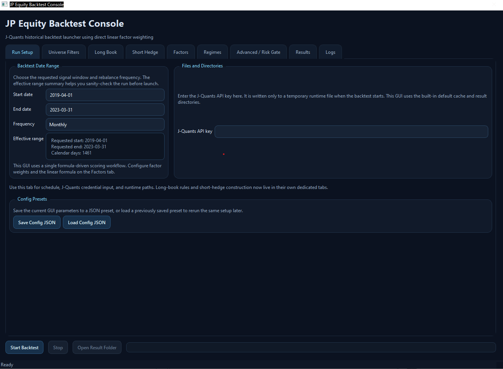
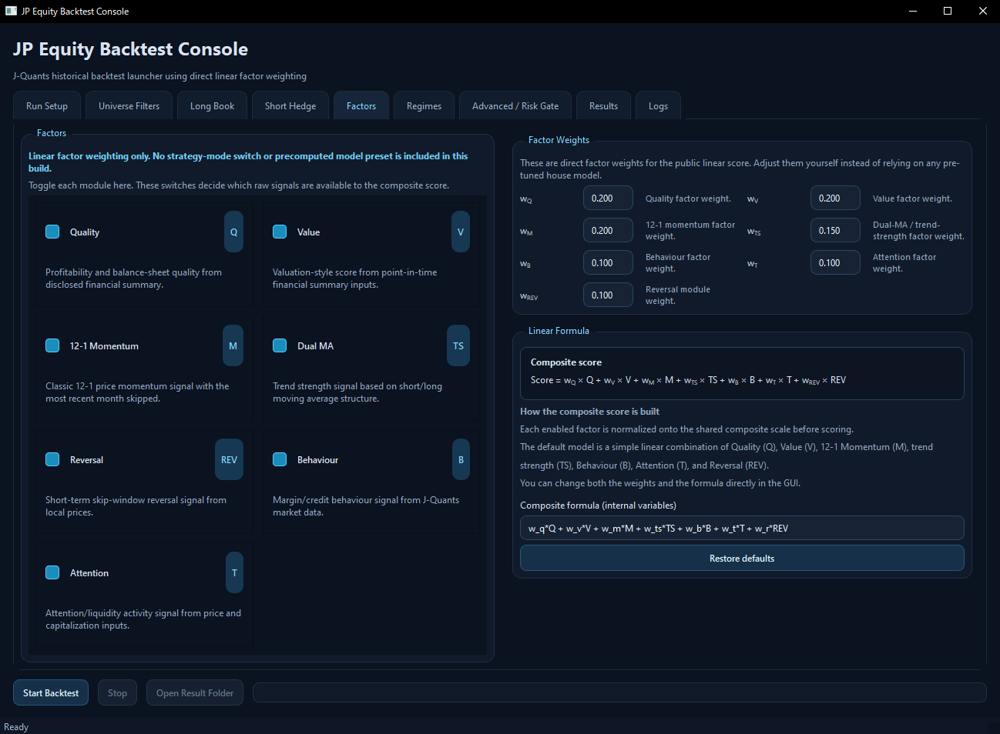
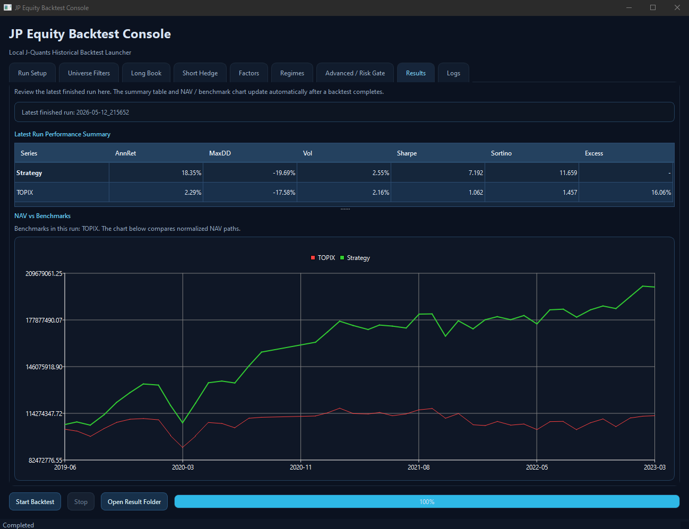

# JP Equity Backtest Console

JP Equity Backtest Console is a local-first Japanese equity factor research and historical backtesting toolkit for users who want to study reproducible equity-selection workflows on their own machine. It supports both a desktop GUI and a CLI, uses user-built J-Quants-backed local caches, and lets users define multi-factor ranking formulas with editable weights and diagnostics-oriented outputs.

This repository is intended for historical research and simulation only. It is not investment advice, not a stock recommendation engine, and not a live trading system. Users must provide their own J-Quants API access, and no JPX or J-Quants source market data is bundled with this repository or should be redistributed from it.

See also:

- [DISCLAIMER.md](./DISCLAIMER.md)
- [LICENSE](./LICENSE)

## What this tool helps you do

- Build and refresh local J-Quants-backed caches for historical research.
- Screen Japanese equities with configurable universe filters.
- Combine quality, value, momentum, trend, reversal, attention, and behaviour factors.
- Edit formulas and factor weights from the GUI or through config-driven CLI runs.
- Run historical rebalance simulations for long-only and optional long/short research workflows.
- Inspect holdings, trades, factor diagnostics, regime and allocation diagnostics, and performance summaries.
- Extend the framework with new factor runtimes and loader-backed research modules.

## What this is not

This repository is not:

- investment advice,
- a stock recommendation engine,
- a live trading or order-routing system,
- a JPX or J-Quants data redistribution channel,
- a guarantee of future or historical performance,
- a substitute for user review of data quality, modeling assumptions, and licensing obligations.

## Screenshots

### Main GUI



### Factor configuration



### Backtest output



Screenshots may use sample or mock data. No JPX or J-Quants market data is bundled with this repository.

## Highlights

- Desktop GUI and CLI entrypoints.
- Local-cache-based historical backtests.
- Formula-driven composite scoring with editable factor weights.
- Standardized `12-1 momentum`.
- Long-only and optional long/short research workflows.
- Extensible factor runtime interface.

## Project motivation

This project was built as a personal research and engineering project for testing Japanese equity factor ideas in a reproducible local environment. The goal is to support data-driven hypothesis testing, local-first financial tooling, configurable historical simulation, and product-minded research workflows while staying aware of data licensing boundaries and the distinction between research software and investment advice.

## Quick start

### Easiest Windows entrypoint

Double-click:

```text
start_here.bat
```

This will:

- create and populate `.venv` if needed,
- install the pinned dependency set when `requirements-lock.txt` is present,
- launch the GUI.

This is the main Windows entrypoint documented for first use.

### Install dependencies

For Windows users, the easiest way is:

```text
Install_GUI_Dependencies.bat
```

This script:

- creates `.venv`,
- upgrades `pip`,
- installs from `requirements-lock.txt` when available,
- otherwise installs from `requirements.txt`,
- prefers a local `.python\python.exe` or Python 3.10 to reduce wheel and build issues on Windows,
- falls back to `virtualenv` automatically when the selected interpreter does not provide the built-in `venv` module.

Manual install is also possible:

```bash
python -m venv .venv
.venv\Scripts\python -m pip install --upgrade pip
.venv\Scripts\python -m pip install -r requirements-lock.txt
```

### GUI

```bash
python runtime/run_gui.py
```

Then:

1. Enter your J-Quants API key.
2. Choose the backtest date range.
3. Adjust enabled factors, formula, and weights.
4. Start the run.

### Dependency files

- `requirements.txt`
  - flexible version ranges for normal maintenance
- `requirements-lock.txt`
  - pinned versions for more reproducible setup and fewer install surprises

## Runtime requirements

- Python 3.10 or newer
- Windows for the bundled `.bat` setup flow
- Access to a user-provided J-Quants API key

Main Python packages are listed in `requirements.txt`:

- `numpy`
- `pandas`
- `pyarrow`
- `PySide6`
- `yfinance`
- `PyYAML`

## Example research question

Example question:

Does a simple value-quality-momentum composite behave differently across Japanese equity market regimes?

```text
Score = 0.3 * Q + 0.3 * V + 0.3 * M + 0.1 * REV
```

In this repository, a user can configure the formula, choose a monthly rebalance schedule, run a historical simulation, and then inspect resulting weights, holdings, trades, factor diagnostics, regime and allocation diagnostics, and summary outputs.

## CLI

```bash
python runtime/run_backtest.py --start 2019-04-01 --end 2023-03-31 --api-file api.txt --config local_backtest_config.example.json --frequency monthly
```

Supported `api.txt` format:

```text
api_key=xxxx
```

## Inputs and outputs

### Inputs

Main inputs are:

- user-built J-Quants-backed local cache tables,
- a runtime config file,
- a GUI-entered API key or CLI `--api-file`,
- start and end dates,
- rebalance frequency,
- factor enablement and composite formula settings.

### Output directory

Each run writes a timestamped folder under the configured `runs_dir`.

Typical outputs include:

- `summary.json`
- `config_used.json`
- `run_status.json`
- weights, holdings, and trades tables
- factor diagnostics
- regime and allocation diagnostics
- performance summaries and time series

## Repository layout

### Entry points

- `start_here.bat`
  - main Windows entrypoint for first-time setup and GUI launch
- `OPEN_BACKTEST_GUI.bat`
  - alternate Windows launcher that opens the GUI directly and triggers setup when required
- `runtime/run_gui.py`
  - starts the PySide6 desktop application
- `runtime/run_backtest.py`
  - thin CLI entrypoint that delegates to `runtime/local_backtest_runner.py`

### Orchestration and engine

- `runtime/local_backtest_runner.py`
  - CLI argument parsing
  - config loading
  - credential loading for scripted runs
  - cache preparation and validation
  - backtest execution
  - output persistence
- `runtime/historical_backtest_engine.py`
  - rebalance loop
  - factor execution
  - factor merge and composite scoring
  - allocation gate and regime logic
  - long-book construction
  - optional short hedge construction
  - execution-price lookup and portfolio updates
  - result table assembly

### Data access

- `runtime/historical_data.py`
  - central local data provider
  - loads prices, fundamentals, market cap, margin, and index data from local cache tables
  - exposes loader methods used by factor runtimes
- `runtime/jquants_cache_builder.py`
  - incremental cache build and refresh utilities for J-Quants-sourced data
- `runtime/factor_cache.py`
  - factor-level caching
- `runtime/snapshot_cache.py`
  - rebalance snapshot caching

### Factor and composite scripts

- `factors/factor_composite.py`
  - normalizes factor frames into a common schema
  - merges factor outputs by code
  - checks staleness and missingness
  - computes the formula-driven composite score

### Factors

- `factors/fundamental_factor_runtime.py`
  - quality and value factors
- `factors/residual_momentum_factor_runtime.py`
  - compatibility-named module now implementing standard `12-1 momentum`
- `factors/dual_ma_factor_runtime.py`
  - trend gate and dual moving-average module
- `factors/reversal_factor_runtime.py`
  - short-horizon reversal
- `factors/attention_factor_runtime.py`
  - attention or crowding proxy
- `factors/behaviour_factor_runtime.py`
  - behaviour or margin-related signal proxy

### Risk and allocation

- `runtime/market_risk_gating_runtime.py`
  - market-level stress and trend risk logic
- `runtime/nikkei_risk_gating_runtime.py`
  - legacy compatibility wrapper
- `runtime/regime_indicator.py`
  - market regime detection
- `runtime/regime_weights.py`
  - weight normalization and resolution helpers
- `runtime/allocation_gate.py`
  - allocation override logic that combines regime and market risk state

### GUI

- `gui_app/main.py`
  - Qt application bootstrap
- `gui_app/ui/main_window.py`
  - main GUI window and form wiring
- `gui_app/adapters/backtest_adapter.py`
  - converts GUI parameters into runtime config and CLI launch arguments
- `gui_app/validators.py`
  - local validation of formula and launch inputs
- `gui_app/config/defaults.py`
  - repository defaults
- `gui_app/config/texts.py`
  - UI copy

## Core workflow

At a high level, a run works like this:

1. A user starts a run from the GUI or CLI.
2. The runner loads config and credentials.
3. The cache layer ensures the required local tables exist.
4. The engine derives rebalance dates.
5. On each rebalance date:
   - the universe is screened,
   - enabled factors are computed,
   - factor outputs are standardized,
   - the composite formula is evaluated,
   - regime and allocation logic are applied,
   - target weights are built,
   - execution assumptions are applied,
   - holdings and performance tables are updated.
6. Outputs are written to a timestamped run directory.

## Public-release changes

The public release intentionally removes or disables private research assets and opinionated internal defaults:

- the precomputed private strategy path was removed,
- private best or latest strategy packaging was removed,
- GUI authentication was simplified to direct API-key entry,
- private dynamic weight-file workflows were removed from the GUI,
- momentum was standardized to classic `12-1 momentum`,
- research caches, saved runs, optimized presets, and local artifacts were excluded.

## Public GUI behavior

The public GUI supports:

- entering a J-Quants API key directly,
- choosing enabled factors,
- editing the composite formula,
- editing factor weights,
- setting universe filters,
- configuring long-book and optional short-hedge settings,
- configuring risk-gate and allocation settings,
- saving and loading non-secret GUI presets.

The public GUI does not expose:

- private optimized strategy bundles,
- private weight-file-driven factor blending.

## Composite model

The composite score is formula-driven rather than model-file-driven.

Default structure:

```text
Score = w_q * Q + w_v * V + w_m * M + w_ts * TS + w_b * B + w_t * T + w_r * REV
```

Meaning:

- `Q`: quality
- `V`: value
- `M`: `12-1 momentum`
- `TS`: dual-MA trend strength
- `B`: behaviour signal
- `T`: attention signal
- `REV`: reversal

The default model is intentionally simple: each factor contributes directly to the final score through a linear weight, and users can edit both the weights and the formula in the GUI.

## Data interface for factors

Every factor runtime should return a dictionary with the following shape:

```python
{
    "minimal": pd.DataFrame(...),
    "detail": pd.DataFrame(...),
    "summary": dict(...),
}
```

### `minimal` frame

`minimal` is the required interface consumed by the engine and composite layer.

At minimum, the frame should contain:

- `code`
- `factor_name`
- `factor_value`
- `signal_date`
- `data_end_date`
- `rebalance_date`

Recommended additional fields:

- `freshness_date`
- a factor-specific raw or scored column
- any metadata the composite layer may reuse, such as `industry` or `log_mcap`

### Optional recognized factor-specific columns

The composite layer can infer factor data from either `factor_value` or recognized factor-specific columns.

Examples:

- quality: `QualityScore`, `quality_score`, `Q`
- value: `ValueScore`, `value_score`, `V`
- momentum: `momentum_score`, `momentum_12_1_score`, or the compatibility alias columns currently emitted by the momentum runtime
- dual MA: `dual_ma_gate`, `TS`
- reversal: `reversal_factor_zscore`, `REV`
- behaviour: `behaviour_score`, `B`
- attention: `attention_score`, `T`

If you emit `factor_value`, the standardizer can still work, but factor-specific columns make debugging easier.

## Loader interfaces

The engine injects loader callables into factor configs through `runtime/historical_data.py` via `JpxHistoricalProvider`.

### Price-history loader

Used by trend-style or panel price factors.

Signature:

```python
loader(
    universe_codes: pd.DataFrame,
    start_date: pd.Timestamp,
    end_date: pd.Timestamp,
    jquants_api_key: str | None = None,
    config: dict[str, Any] | None = None,
) -> pd.DataFrame
```

Current provider method:

- `JpxHistoricalProvider.load_price_history(...)`

### Attention-input loader

Used when a factor needs prices plus capitalization-related fields.

Current provider method:

- `JpxHistoricalProvider.load_attention_inputs(...)`

### Behaviour-input loader

Used when a factor needs margin data, market cap, and trading-value context.

Current provider method:

- `JpxHistoricalProvider.load_behaviour_inputs(...)`

### Fundamental loader

Used by point-in-time statement factors.

Signature:

```python
loader(universe: pd.DataFrame, config: dict[str, Any]) -> pd.DataFrame
```

Current provider method:

- `JpxHistoricalProvider.load_fundamental_panel(...)`

Expected output is a point-in-time panel keyed by `code`, typically including fields such as:

- `StatementDate`
- `MarketCap`
- `TotalRevenue`
- `GrossProfit`
- `OperatingIncome`
- `EBIT`
- `EBITDA`
- `NetIncome`
- `TotalAssets`
- `StockholdersEquity`
- `TotalDebt`
- `CashAndCashEquivalents`
- `OperatingCashFlow`
- `FreeCashFlow`

### Wide close-price loader

Used by the public momentum module.

Signature:

```python
loader(
    tickers: Iterable[str],
    start_date: pd.Timestamp,
    end_date: pd.Timestamp,
    config: dict[str, Any],
) -> pd.DataFrame
```

Current provider method:

- `JpxHistoricalProvider.load_close_prices(...)`

Expected output is a wide date-indexed table of close prices.

## How to add a new factor

To add a new factor cleanly, follow this sequence.

### 1. Create a runtime module

Add a file following the same pattern as the existing factor runtimes.

The runtime should expose a function like:

```python
def run_my_factor(
    universe: pd.DataFrame | str | Path,
    rebalance_date: str | pd.Timestamp,
    jquants_api_key: str | None = None,
    config: dict[str, Any] | None = None,
) -> dict[str, Any]:
    ...
```

Return a `{"minimal", "detail", "summary"}` payload.

### 2. Decide what loader the factor needs

Use one of the existing loader patterns when possible:

- `fundamental_loader`
- `price_loader`
- `panel_price_loader`
- `attention_loader`
- `behaviour_loader`
- `close_loader`

If none fits, add a new provider method in `runtime/historical_data.py` and inject it from `_factor_config(...)` in `runtime/historical_backtest_engine.py`.

### 3. Register the factor in the engine

Update:

- `runtime/historical_backtest_engine.py`
  - import the runtime
  - add it to the `runners` map
  - inject any required loader in `_factor_config(...)`

### 4. Register the factor in the composite layer

Update `factors/factor_composite.py`:

- add an alias in `normalize_factor_name_for_composite(...)`,
- add or extend `FACTOR_SPECS`,
- make sure column inference can find your raw or scored column.

### 5. Register the factor in the GUI

If the factor should be user-visible, update:

- `gui_app/config/defaults.py`
  - add a `FactorDefinition`
  - optionally expose weight semantics
- `gui_app/validators.py`
  - extend formula validation mapping if new variables are introduced

### 6. Keep the interface stable

For compatibility with the existing composite layer, try to keep:

- `code` normalized to 4-digit JP equity codes where applicable,
- dates parseable by pandas,
- `factor_value` numeric,
- one row per `code` for the rebalance snapshot.

### 7. Make missing data graceful

Non-critical factors should fail softly:

- return a `minimal` frame with `NaN` values,
- keep `summary["error"]`,
- avoid crashing the entire run unless the factor is explicitly required.

## Factor design guidance

When implementing new factors in this repository, it is best to follow these conventions:

- Use point-in-time data only.
- Emit one rebalance snapshot per code.
- Record freshness explicitly.
- Keep `detail` rich for debugging, but keep `minimal` compact and stable.
- Prefer provider-injected local loaders over direct network access.
- Treat the runtime as deterministic and side-effect-light.

## Authentication model

### GUI

The GUI accepts:

- `API key`

The GUI writes the key only to a temporary runtime file before launch and uses the built-in default `data_cache` and `backtest_runs` directories.

### CLI

The CLI accepts:

```bash
--api-file api.txt
```

Supported file format:

```text
api_key=xxxx
```

## Compliance and usage boundaries

This repository is a research tool built around user-managed local data caches and historical simulation workflows.

- No JPX or J-Quants source market data is bundled with this repository.
- Users must bring their own J-Quants API access and remain responsible for the way they obtain, store, use, and retain data.
- Users must comply with applicable JPX and J-Quants terms, contracts, and data-usage restrictions.
- Outputs from this repository are research artifacts, not investment advice, not stock recommendations, and not trading instructions.
- Historical backtest results, factor diagnostics, and summaries are not guarantees of future or historical performance quality.
- Publishing derived outputs, redistributing data-bearing artifacts, or building external services on top of this workflow may require separate permission, licensing review, or legal review.

Before publishing outputs or derived services, read:

- [DISCLAIMER.md](./DISCLAIMER.md)

## Security and secrets

- Do not commit API keys, cache files, saved runs, or private presets.
- Prefer local config files, local environment variables, or other non-public local mechanisms for secrets.
- Review `.gitignore` before publishing the repository or sharing archives.
- Treat cached market data and run outputs as potentially sensitive from a licensing and confidentiality perspective even when they are not direct source dumps.

## License

This repository is released under the MIT License.

- [LICENSE](./LICENSE)
